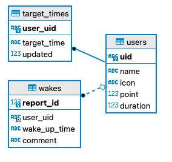

# asamit-backend-test

## Overview

第 34 回 高専プロコン作品 Asamit！の試験用バックエンド

## Requirement

### OS

- Mac OS Ventura 13.0(動作確認済み)

### Library

- Go
  - Gin
  - GORM
- Docker
- docker-compose

## Installation(local)

1. Clone this repository

```
git clone git@github.com:Asamit-NITTC/asamit-backend-test.git
```

2. Change directory

```
cd asamit-backend-test
```

3. Build docker image

```
docker-compose up -d
```

4. Create database

ボリュームマウントでは何故か docker-compose.yml ファイルで DB 構築出来なかった為仕方なく...

```
docker-compose exec -it mysql bash
```

```
mysql -u root -p
```

```
password
```

```
CREATE DATABASE asamit;
```

## Usage(local)

1. Build & start container

```
docker-compose up -d
```

2.

```
docker-compose exec api go run main.go
```

## DB

暫定



## Author

- [Yuta Ito](https://github.com/GoRuGoo)
